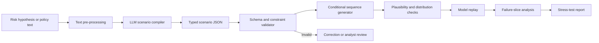
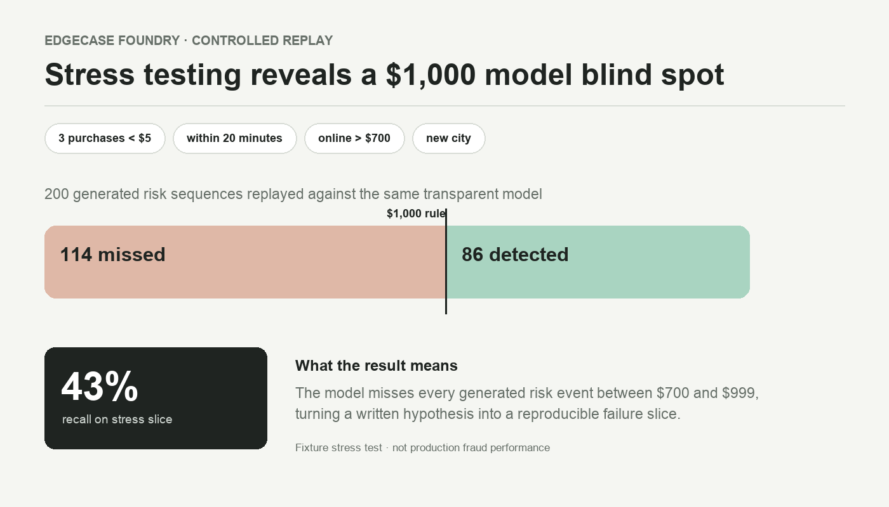

# EdgeCase Foundry

EdgeCase Foundry turns a plain-language risk hypothesis into a reproducible stress test for a transaction model. It helps an analyst answer: *where does the model fail when behaviour changes?*

## Example

An analyst writes:

> Generate accounts with three purchases below $5, followed within 20 minutes by an online transaction above $700 from a new city.

The system converts this into a typed scenario, validates the constraints, generates controlled transaction sequences and compares a baseline model's performance on normal and stressed populations.

## System flow

```text
risk hypothesis in plain language
             |
             v
LLM compiler -> typed scenario specification
             |
             v
schema and financial constraint validation
             |
             v
conditional sequence generator
             |
             v
plausibility and distribution checks
             |
             v
model replay -> failure slices -> experiment report
```

The compiler is intentionally separated from execution. An LLM may propose a scenario, but deterministic code validates every field before a test can run. This makes the experiment reproducible and prevents generated prose from silently changing model inputs.

The local demo includes a deterministic compiler for one supported hypothesis family. It proves the specification, validation, generation and replay path without requiring an API key. The full experiment will compare this baseline with constrained LLM compilation.

## Architecture



### Hypothesis compilation

The implemented compiler lowercases the hypothesis, maps number words such as `three` to integers and uses regular expressions to extract the final amount and time window. Keyword rules identify the transaction channel and whether the final event requires a new city. Inputs without an amount or time window are rejected rather than completed with guessed values.

The next compiler uses `Qwen2.5-3B-Instruct` with temperature `0`, constrained JSON decoding and the same `Scenario` schema used by the Python executor. The prompt contains the supported fields, units and operators, plus a small set of reviewed examples. The LLM translates prose into a specification; it never creates transaction rows or changes validation rules.

```json
{
  "small_count": 3,
  "small_max_amount": 5,
  "final_min_amount": 700,
  "window_minutes": 20,
  "final_channel": "online",
  "require_new_city": true
}
```

### Deterministic validation

The scenario is stored as a frozen Python dataclass. Validation restricts `small_count` to 1–20, requires positive amounts, enforces `final_min_amount > small_max_amount`, limits the window to 1–1,440 minutes and allows only `online`, `chip` or `contactless` channels. Unknown fields, invalid ranges and contradictory values fail before generation. The accepted JSON, compiler version and random seed are stored with the run.

### Conditional generation

The implemented generator uses Python's seeded `random.Random` to create reproducible sequences. Small purchases are sampled below the scenario maximum, event times remain inside the requested window and the final city is sampled from cities other than the account's home city when required. The full experiment will condition a TabFormer sequence model on the validated scenario and reject samples that fail deterministic constraints. Generated data is checked for constraint satisfaction, duplicates and distribution distance from the reference population.

### Model replay and post-processing

The current replay model is deliberately transparent: it flags an event only when the amount is at least `$1,000` and the channel is online. This makes it possible to verify whether a generated scenario exposes the expected threshold blind spot. The full replay stage will score reference and stressed populations with the same trained model, then calculate recall, precision, false-positive change and performance by scenario intensity. The report records the validated scenario, dataset and model versions, seed, constraint pass rate and feature-distribution changes.

## Data

The large-scale experiment will use the public synthetic transaction data from [IBM TabFormer](https://github.com/IBM/TabFormer), which contains 24 million records and 12 fields. Synthetic data is appropriate here because this is a model-testing project, but conclusions will be limited to the tested model and dataset.

The repository includes a deterministic fixture generator so the complete scenario can be replayed without downloading the full dataset.

## What gets measured

### Scenario compiler

- exact match for fields and operators
- constraint validity rate
- unsupported-instruction detection

### Generated population

- constraint satisfaction
- invalid sequence rate
- feature-distribution distance
- duplicate and memorisation checks

### Model behaviour

- recall and precision on baseline versus stress slices
- change in false-positive rate
- detection rate by scenario intensity
- feature-attribution shift
- inference latency

## Demonstration result

The included scenario generated 200 valid sequences from a fixed seed. The transparent threshold model detected 86 of the 200 final risk events, producing recall of `0.43` on the stress slice. The purpose of this fixture is to verify that the workbench exposes the known `$1,000` threshold blind spot.

The complete recorded report is available in [`results/demo_report.json`](results/demo_report.json).



## Run the demo

Requires Python 3.10+ and no external packages.

```bash
python3 -m edgecase_foundry.cli \
  --hypothesis "three small purchases then an online purchase above 700 within 20 minutes from a new city" \
  --count 200 \
  --seed 17
```

Run tests:

```bash
python3 -m unittest discover -s tests -v
```

## Limitations

- Synthetic tests reveal possible blind spots; they do not estimate real fraud losses.
- A generator can encode unrealistic correlations even when individual fields look valid.
- A scenario written by an analyst can reflect an incomplete or biased hypothesis.
- Results depend on the reference data and the model under test.
