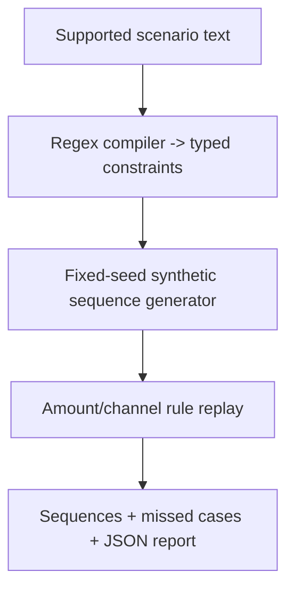

# EdgeCase Foundry

Project report | Harsh Saand | 22 September 2026

## The problem

A decision rule can look adequate until a specific sequence exposes its blind spot. EdgeCase Foundry turns a supported scenario into controlled transaction sequences and replays a baseline against them.

## What a user gets

The output contains a typed scenario, generated sequences, per-event decisions and a report of detected and missed injected events.

## Practical value

The 200-sequence demonstration exposes the tested amount/channel rule missing 114 injected events. This is a reproducible software stress test. It does not estimate real customer fraud prevalence or losses.

## Logic and flow



<details>
<summary><strong>Architecture</strong></summary>

### Hypothesis compilation

The implemented compiler lowercases the hypothesis, maps number words such as `three` to integers and uses regular expressions to extract the final amount and time window. Keyword rules identify the transaction channel and whether the final event requires a new city. Inputs without an amount or time window are rejected rather than completed with guessed values.

A future compiler could use a language model, but the current implementation uses regular expressions.

```json
{
  "small_count": 3,
  "small_max_amount": 5,
  "final_min_amount": 700,
  "window_minutes": 20,
  "final_channel": "online",
  "require_new_city": true
}
```

### Deterministic validation

The scenario is stored as a frozen Python dataclass. Validation restricts `small_count` to 1-20, requires positive amounts, enforces `final_min_amount > small_max_amount`, limits the window to 1-1,440 minutes and allows only `online`, `chip` or `contactless` channels. Unknown fields, invalid ranges and contradictory values fail before generation. The accepted JSON, compiler version and random seed are stored with the run.

### Conditional generation

The implemented generator uses Python's seeded `random.Random` to create reproducible sequences. Small purchases are sampled below the scenario maximum, event times remain inside the requested window and the final city is sampled from cities other than the account's home city when required. The full experiment will condition a TabFormer sequence model on the validated scenario and reject samples that fail deterministic constraints. The current fixture validates the scenario and generated sequence constraints; broad distribution-fidelity evaluation is not established.

### Model replay and post-processing

The current replay model is deliberately transparent: it flags an event only when the amount is at least `$1,000` and the channel is online. This makes it possible to verify whether a generated scenario exposes the expected threshold blind spot. The full replay stage will score reference and stressed populations with the same trained model, then calculate recall, precision, false-positive change and performance by scenario intensity. The report records the validated scenario, dataset and model versions, seed, constraint pass rate and feature-distribution changes.

</details>

<details>
<summary><strong>Data</strong></summary>

The large-scale experiment will use the public synthetic transaction data from [IBM TabFormer](https://github.com/IBM/TabFormer), which contains 24 million records and 12 fields. Synthetic data is appropriate here because this is a model-testing project, but conclusions will be limited to the tested model and dataset.

The repository includes a deterministic fixture generator so the complete scenario can be replayed without downloading the full dataset.

</details>

<details>
<summary><strong>Demonstration result</strong></summary>

The included scenario generated 200 valid sequences from a fixed seed. The transparent threshold model detected 86 of the 200 final risk events, producing recall of `0.43` on the stress slice. The purpose of this fixture is to verify that the workbench exposes the known `$1,000` threshold blind spot.

The complete recorded report is available in [`results/demo_report.json`](https://github.com/HarshSaand/edgecase-foundry/blob/1fa121ce81af4673c02b2bb5b9d3f491d61634a3/results/demo_report.json).

</details>

<details>
<summary><strong>Limitations</strong></summary>

- Synthetic tests reveal possible blind spots; they do not estimate real fraud losses.
- A generator can encode unrealistic correlations even when individual fields look valid.
- A scenario written by an analyst can reflect an incomplete or biased hypothesis.
- Results depend on the reference data and the model under test.

</details>

<details>
<summary><strong>Run the demo</strong></summary>

Requires Python 3.10+ and no external packages.

```bash
python3 -m edgecase_foundry.cli \
  --hypothesis "three small purchases then an online purchase above 700 within 20 minutes from a new city" \
  --count 200 \
  --seed 17
```

Run tests:

```bash
python3 -m unittest discover -s tests -v
```

</details>

## Evidence and reproduction references

Source revision: 1fa121ce81af4673c02b2bb5b9d3f491d61634a3

- [README.md](https://github.com/HarshSaand/edgecase-foundry/blob/1fa121ce81af4673c02b2bb5b9d3f491d61634a3/README.md)
- [docs/output-example.json](https://github.com/HarshSaand/edgecase-foundry/blob/1fa121ce81af4673c02b2bb5b9d3f491d61634a3/docs/output-example.json)
- [results/demo_report.json](https://github.com/HarshSaand/edgecase-foundry/blob/1fa121ce81af4673c02b2bb5b9d3f491d61634a3/results/demo_report.json)

This report describes the source and saved evidence at the revision above. Training and full benchmark runs were not repeated for this documentation release. Dataset, model and dependency licences remain separate from the project documentation.
